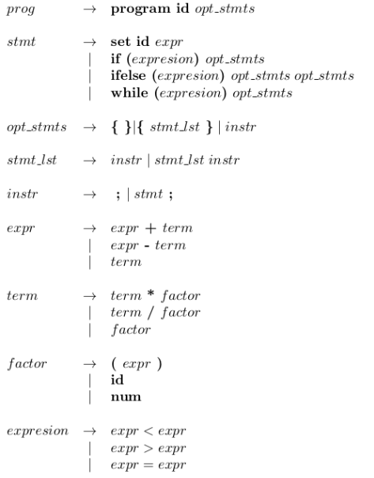
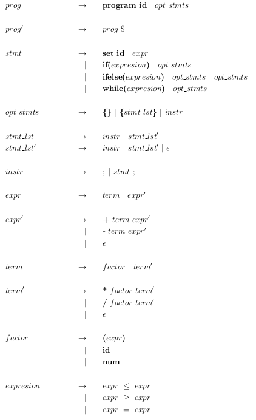
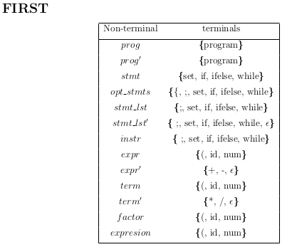
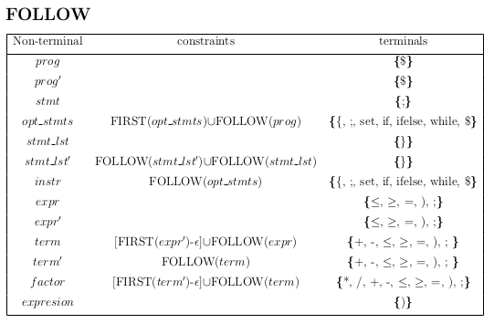

# Syntax recognizer

Homework #3 for Compilers Design course. Given a Context Free grammar, 
* build a LL(1) parser: perform leftmost derivation, FIRST and FOLLOW tables.
* code a syntax recognizer which indicates if a program belongs to the given Context Free grammar.
* Use Flex and C++.

## Compiling and running

## Context Free Grammar

## Leftmost derivation

## FIRST table

## FOLLOW table

